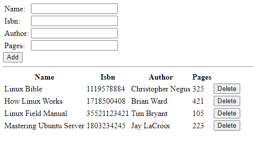

# **MEAN STACK IMPLEMENTATION ON AWS**

**1. MongoDB (Document database) –** Stores and allows retrieval of data.

**2. Express (Back-end application framework) –** Makes requests to Database for Reads and Writes.

**3. Angular (Front-end application framework) –** Handles Client and Server Requests

**4. Node.js (JavaScript runtime environment) –** Accepts requests and displays results to end user

In this project, we are going to implement a simple **Book Register web form using MEAN stack.**

*Let's dive in!*

## **Step 1: Install NodeJs**

Node.js is a JavaScript runtime built on Chrome’s V8 JavaScript engine. Node.js is used in this tutorial to set up the Express routes and AngularJS controllers.

Update Ubuntu

`sudo apt update`

Upgrade ubuntu

`sudo apt upgrade`

Add certificates

`sudo apt -y install curl dirmngr apt-transport-https lsb-release ca-certificates`
 
`curl -sL https://deb.nodesource.com/setup_12.x | sudo -E bash -`

Install NodeJS

`sudo apt install -y nodejs`

## **Step 1: Install MongoDB**

`sudo apt install -y mongodb`

Installing MongoDB on Ubuntu 22.04 returned some errors because as at time of doing this documentation, MongoDB does not support the version so i had to downgrade my OS to Ubuntu 20.04

Next step is to start the server:

`sudo service mongodb start`

Verify that the service is up and running:

`sudo systemctl status mongodb`

Install npm – Node package manager:

`sudo apt install -y npm`

Install body-parser package - The need for installing the **body-parser package** is to help process JSON files passed in requests to the server.

`sudo npm install body-parser`

Create a directory named **Books** and navigate into the Books directory

`mkdir Books && cd Books`

In the Books directory, Initialize npm project

`npm init`

Add a file to the directory named **server.js**

`nano server.js`

Copy and paste the web server code below into the **server.js** file.

```
var express = require('express');
var bodyParser = require('body-parser');
var app = express();
app.use(express.static(__dirname + '/public'));
app.use(bodyParser.json());
require('./apps/routes')(app);
app.set('port', 3300);
app.listen(app.get('port'), function() {
    console.log('Server up: http://localhost:' + app.get('port'));
});
```

## INSTALL EXPRESS AND SET UP ROUTES TO THE SERVER

## **Step 3: Install Express and set up routes to the server**

We will use **Express** to pass book information to and from our MongoDB database while we will use **Mongoose** to establish a schema for the database to store data of our book register.

`sudo npm install express mongoose`

In **Books** directory, create a folder named **apps** and navigate into the directory

`mkdir apps && cd apps`

Create a file named **routes.js**

`nano routes.js`

Copy and paste the code below into routes.js

```
var Book = require('./models/book');
module.exports = function(app) {
  app.get('/book', function(req, res) {
    Book.find({}, function(err, result) {
      if ( err ) throw err;
      res.json(result);
    });
  }); 
  app.post('/book', function(req, res) {
    var book = new Book( {
      name:req.body.name,
      isbn:req.body.isbn,
      author:req.body.author,
      pages:req.body.pages
    });
    book.save(function(err, result) {
      if ( err ) throw err;
      res.json( {
        message:"Successfully added book",
        book:result
      });
    });
  });
  app.delete("/book/:isbn", function(req, res) {
    Book.findOneAndRemove(req.query, function(err, result) {
      if ( err ) throw err;
      res.json( {
        message: "Successfully deleted the book",
        book: result
      });
    });
  });
  var path = require('path');
  app.get('*', function(req, res) {
    res.sendfile(path.join(__dirname + '/public', 'index.html'));
  });
};
```

In the **apps** directory, create a folder named **models** and navigate into it

`mkdir models && cd models`

Create a file named **book.js**

nano book.js

```
var mongoose = require('mongoose');
var dbHost = 'mongodb://localhost:27017/test';
mongoose.connect(dbHost);
mongoose.connection;
mongoose.set('debug', true);
var bookSchema = mongoose.Schema( {
  name: String,
  isbn: {type: String, index: true},
  author: String,
  pages: Number
});
var Book = mongoose.model('Book', bookSchema);
module.exports = mongoose.model('Book', bookSchema);
```

## **Step 4 – Access the routes with AngularJS**

**AngularJS** provides a web framework for creating dynamic views in your web applications.

Change the directory back to **Books**

`cd ../..`

Create a directory named **public** and navigate into it

`mkdir public && cd public`

Create a file named **script.js**

`nano script.js`

Copy and paste the Code below into the **script.js** file

```
var app = angular.module('myApp', []);
app.controller('myCtrl', function($scope, $http) {
  $http( {
    method: 'GET',
    url: '/book'
  }).then(function successCallback(response) {
    $scope.books = response.data;
  }, function errorCallback(response) {
    console.log('Error: ' + response);
  });
  $scope.del_book = function(book) {
    $http( {
      method: 'DELETE',
      url: '/book/:isbn',
      params: {'isbn': book.isbn}
    }).then(function successCallback(response) {
      console.log(response);
    }, function errorCallback(response) {
      console.log('Error: ' + response);
    });
  };
  $scope.add_book = function() {
    var body = '{ "name": "' + $scope.Name + 
    '", "isbn": "' + $scope.Isbn +
    '", "author": "' + $scope.Author + 
    '", "pages": "' + $scope.Pages + '" }';
    $http({
      method: 'POST',
      url: '/book',
      data: body
    }).then(function successCallback(response) {
      console.log(response);
    }, function errorCallback(response) {
      console.log('Error: ' + response);
    });
  };
});
```

In the public folder, create a file named **index.html**

`nano index.html`

Copy and paste the code below into **index.html** file

```
<!doctype html>
<html ng-app="myApp" ng-controller="myCtrl">
  <head>
    <script src="https://ajax.googleapis.com/ajax/libs/angularjs/1.6.4/angular.min.js"></script>
    <script src="script.js"></script>
  </head>
  <body>
    <div>
      <table>
        <tr>
          <td>Name:</td>
          <td><input type="text" ng-model="Name"></td>
        </tr>
        <tr>
          <td>Isbn:</td>
          <td><input type="text" ng-model="Isbn"></td>
        </tr>
        <tr>
          <td>Author:</td>
          <td><input type="text" ng-model="Author"></td>
        </tr>
        <tr>
          <td>Pages:</td>
          <td><input type="number" ng-model="Pages"></td>
        </tr>
      </table>
      <button ng-click="add_book()">Add</button>
    </div>
    <hr>
    <div>
      <table>
        <tr>
          <th>Name</th>
          <th>Isbn</th>
          <th>Author</th>
          <th>Pages</th>
 
        </tr>
        <tr ng-repeat="book in books">
          <td>{{book.name}}</td>
          <td>{{book.isbn}}</td>
          <td>{{book.author}}</td>
          <td>{{book.pages}}</td>
 
          <td><input type="button" value="Delete" data-ng-click="del_book(book)"></td>
        </tr>
      </table>
    </div>
  </body>
</html>
```

Change the directory back up to Books

`cd ..`

Start the server by running this command:

`node server.js`

The server should be up and running, we can connect it via port 3300.

`http://localhost:3300`

Now you can access our Book Register web application from the Internet with a browser using a Public IP address or Public DNS name.

You can find your server's Public IP in your AWS web console in EC2 details

This is how your WebBook Register Application will look in the browser:




*Thank you!!*


